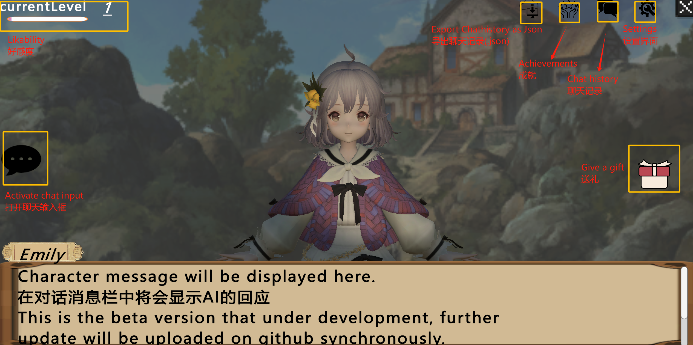

# Unity WebGL Chatbot

This Unity WebGL project implements a simple chatbot interface, where the user can interact with an AI character by typing text or selecting different gift options. The chatbot uses a dialogue manager and allows the user to send predefined gift descriptions to the AI, which responds based on the interaction.

## Features

## 1. Amiable Conversation with ChatBot
Engage in natural, friendly dialogues with ChatBot. Powered by DeepSeek, it understands your input and responds in a personable manner, ensuring conversations that feel both intuitive and enjoyable.

## 2. Interactive Gift Giving
Add a personal touch to your interactions by sending virtual gifts. This feature allows you to select from a variety of gifts, each with its own unique description and impact, fostering a more meaningful exchange.

## 3. Likability Enhancement
Watch your rapport grow as you converse with the ChatBot. Our likability enhancement mechanism rewards positive interactions, gradually improving your influence within the conversation and unlocking new possibilities.

## 4. Achievement System (Ongoing)
Track your milestones and celebrate your progress with our comprehensive achievement system. Earn badges and rewards as you reach new heights in your interactions, adding an element of fun and motivation to every conversation.

## 5. Dialogue History
Never lose track of a great conversation. With our dialogue history feature, you can review past chats at any time, allowing you to revisit key moments, insights, or simply relive your favorite interactions.

## Usage

Click to enter [Program interface](https://lem-c.github.io/Unity-webGL-chatbot/). Start an ai conversation by entering a deepseek API.

### Chatbot Interaction

1. **Text Input**: The user can type messages into the TMP input field and press "Enter" to send the message to the AI. The AI will respond, and the response will be displayed in a TMP Text field.
   
2. **Gift Buttons**: The user can click any of the gift buttons to send a predefined gift description to the AI. When a gift button is clicked:
   - The button is disabled.
   - The selected gift information is displayed on the screen.
   - A dialogue request is sent to the AI character with the corresponding gift description.

3. **AI Response**: The AI responds to both text input and gift interactions, displaying responses in the dialogue text area.

### Example Workflow

1. The user types a message in the input field and presses "Enter".
2. The AI responds to the message and displays the response in the dialogue.
3. The user clicks a gift button.
4. The selected gift description is displayed in the `selectedGiftInfoText` field.
5. The AI responds to the gift interaction and displays its response.

## Files and Structure

- **UIController.cs**: Manages the UI interactions such as showing/hiding panels, handling button clicks, and sending dialogue requests.
- **CharacterInteract.cs**: Handles the interaction with gift buttons, updating the selected gift information, and sending dialogue requests to the AI.
- **DeepSeekDialogueManager.cs**: (or your AI dialogue manager script) Handles the interaction with the AI, processes user inputs, and generates responses.
- **Scenes**: Contains the Unity scene with all the UI elements and interactive components set up.
- ...

## Contributing

The project is currently under development...

## Acknowledgments

- Thanks to [DeepSeek](https://platform.deepseek.com/) for providing strong api support.
- Thanks to [Unity Technologies](https://unity.com/) for the powerful Unity engine.
- Thanks to [Penny Lu](https://developer.unity.cn/projects/679a12dbedbc2adb85659390) provide Unity access to DeepSeek to achieve AI dialogue function.
